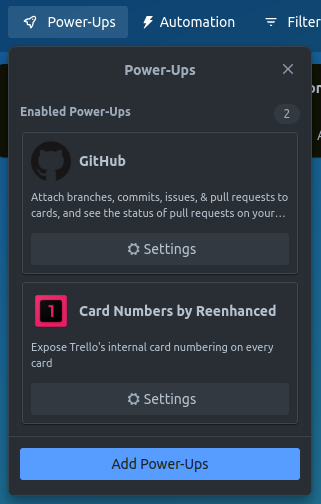
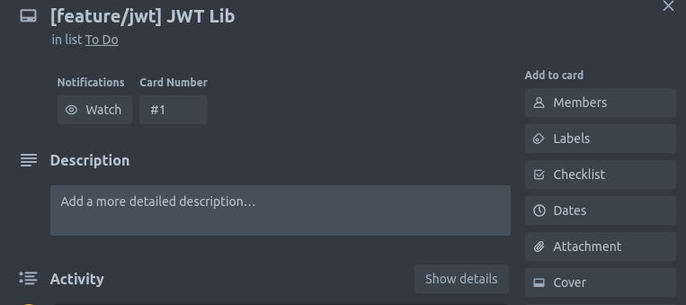
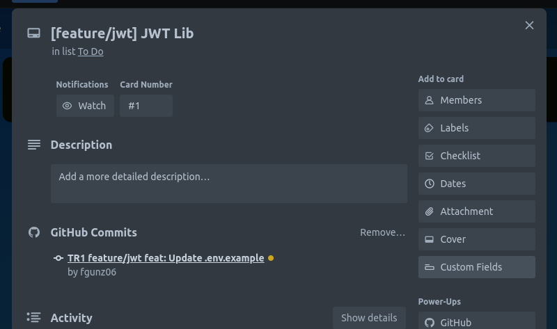

# :wine_glass:trello-action

Github action for trello integration add comment attach link to trello card
and move card automatically to list after commit or push

## Table of Contents
- [Installation](#installation)
- [Usage](#usage)
- [Contributing](#contributing)
- [License](#license)

## Installation

```npm
npm install
```

## Usage
Install/Enable trello power-up's in your trello board ```Github, Card Numbers by Reenhanced```   



<br/>
In github workflow file <code>.yml</code>
```yml
name: Trello action
on:
  push:
    branches:
      - main
      - "feature/*"

jobs:
  build:
    runs-on: ubuntu-latest
      steps:
        - uses: annoyingmice/trello-action@main
          with:
            tr-key: xxx # Trello api key, visit https://trello.com/app-key
            tr-token: xxx # Trello auth token, visit https://trello.com/app-key
            tr-board: xxx # Trello board ID
            tr-list: xxx # e.g 'Back Logs,Bugs,In Progress,For QA,Done'
```
<br/>
Note: Please follow commit/comment(pull_request) format e.g "#card feat(docs)!: updated docs""

## Contributing

Thank you for considering contributing to this project! We welcome contributions from the community to help improve and grow the project. Please take a moment to review the following guidelines before getting started.

### How to Contribute

1. Fork the repository and create your branch from `main`.
2. Clone the forked repository to your local machine.
3. Make your changes and test thoroughly.
4. Commit your changes with clear and descriptive commit messages.
5. Push your changes to your forked repository.
6. Submit a pull request to the `main` branch of the original repository.

### Code Style and Guidelines

- Follow the existing code style and conventions used in the project.
- Ensure your code adheres to best practices, is well-documented, and easy to understand.
- Write meaningful commit messages that clearly describe your changes.

### Reporting Issues

- Before submitting a new issue, please check the existing issues to avoid duplicates.
- Include a clear and concise description of the issue and steps to reproduce (if applicable).
- Provide any relevant error messages, stack traces, or screenshots that can help diagnose the problem.

### Pull Request Guidelines

- Explain the purpose and goal of your pull request.
- Provide a clear description of the changes you've made.
- Ensure that your pull request includes the necessary tests or documentation updates (if applicable).
- Be responsive to any feedback or questions regarding your pull request.

### Code of Conduct

Please note that this project adheres to a [Code of Conduct](link-to-code-of-conduct.md). By participating in this project, you are expected to uphold this code of conduct. Any unacceptable behavior should be reported to mhikeking1@gmail.com.

We appreciate your contributions to this project and look forward to your involvement!

## License

[GNU GENERAL PUBLIC LICENSE Version 3, 29 June 2007](https://www.gnu.org/licenses/gpl-3.0.en.html)